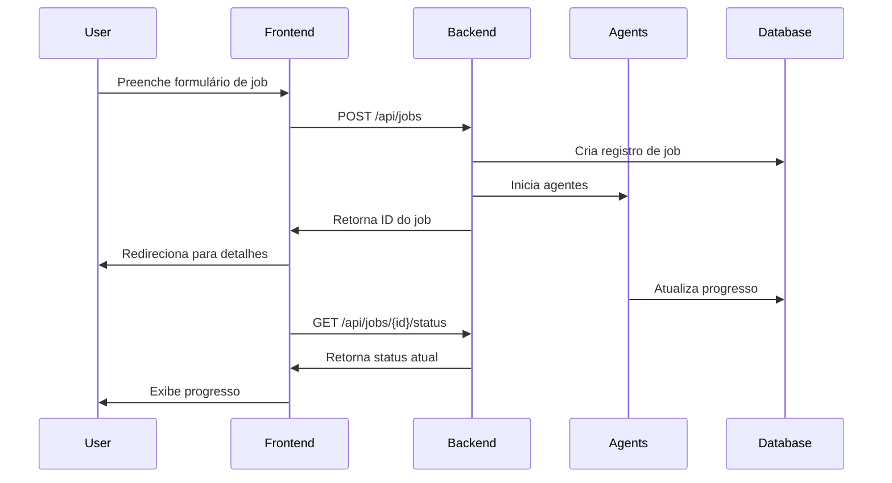
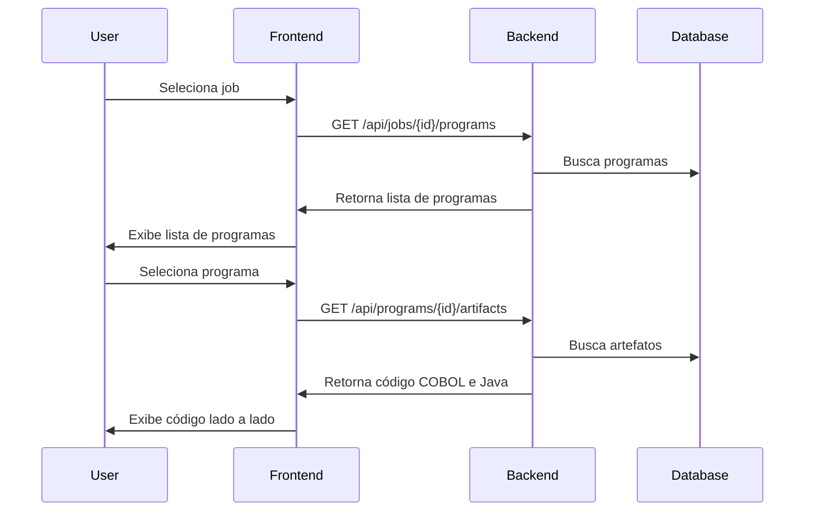

# Arquitetura do Sistema

Este documento descreve a arquitetura do sistema Agent Crew para Migração COBOL para Java.

## Visão Geral

O sistema utiliza uma arquitetura de três camadas:

1. **Frontend**: Interface de usuário React/TypeScript
2. **Backend**: API REST FastAPI/Python
3. **Agentes**: Sistema multi-agente baseado em CrewAI


## Componentes Principais

### 1. Frontend (React/TypeScript)

O frontend é uma aplicação React moderna com TypeScript, utilizando:

- **React 18**: Biblioteca de UI
- **TypeScript**: Tipagem estática
- **TailwindCSS**: Framework CSS utilitário
- **shadcn/ui**: Componentes de UI
- **React Query**: Gerenciamento de estado e cache
- **React Router**: Roteamento
- **Axios**: Cliente HTTP

#### Estrutura de Diretórios

```
frontend/
├── public/           # Arquivos estáticos
├── src/
│   ├── assets/       # Imagens e recursos
│   ├── components/   # Componentes React
│   │   ├── layout/   # Componentes de layout
│   │   └── ui/       # Componentes de UI (shadcn)
│   ├── hooks/        # Hooks personalizados
│   ├── lib/          # Utilitários e helpers
│   ├── pages/        # Páginas da aplicação
│   ├── services/     # Serviços de API
│   ├── App.tsx       # Componente principal
│   └── main.tsx      # Ponto de entrada
└── index.html        # Template HTML
```

#### Páginas Principais

- **Dashboard**: Visão geral dos jobs e métricas
- **NewJob**: Formulário para criar jobs de migração
- **CodeExplorer**: Visualizador de código COBOL e Java
- **ReviewQueue**: Fila de revisão de código
- **TestResults**: Resultados de testes
- **Metrics**: Métricas detalhadas
- **Settings**: Configurações do sistema

### 2. Backend (FastAPI/Python)

O backend é uma API REST construída com FastAPI, utilizando:

- **FastAPI**: Framework web assíncrono
- **SQLAlchemy**: ORM para Python
- **Pydantic**: Validação de dados
- **CrewAI**: Framework para orquestração de agentes
- **SQLite/PostgreSQL**: Banco de dados

#### Estrutura de Diretórios

```
backend/
├── app/
│   ├── api/          # Endpoints REST
│   ├── core/         # Configurações
│   ├── crew/         # Agentes CrewAI
│   │   └── agents/   # Implementação dos agentes
│   ├── models/       # Modelos de dados
│   └── services/     # Serviços de negócio
├── main.py           # Entry point
└── requirements.txt  # Dependências
```

#### Endpoints Principais

- **GET /health**: Status de saúde da API
- **POST /api/jobs**: Criar novo job de migração
- **GET /api/jobs**: Listar jobs
- **GET /api/jobs/{job_id}**: Detalhes do job
- **GET /api/jobs/{job_id}/status**: Status do job
- **GET /api/jobs/{job_id}/programs**: Programas do job

### 3. Agentes (CrewAI)

O sistema utiliza uma arquitetura multi-agente baseada em CrewAI para realizar a migração de código:

- **InventoryAgent**: Escaneia repositórios e identifica programas COBOL
- **COBOLParserAgent**: Analisa código COBOL e gera AST
- **TranslatorAgent**: Traduz COBOL para Java
- **TestGeneratorAgent**: Gera testes unitários
- **ValidatorAgent**: Valida código e executa testes

#### Fluxo de Trabalho dos Agentes

1. **InventoryAgent** escaneia o repositório e identifica programas COBOL
2. **COBOLParserAgent** analisa cada programa e gera uma representação intermediária
3. **TranslatorAgent** converte a representação intermediária em código Java
4. **TestGeneratorAgent** cria testes unitários para o código Java
5. **ValidatorAgent** executa os testes e valida a qualidade do código

## Modelo de Dados

### Entidades Principais

#### MigrationJob

```python
class MigrationJob(Base):
    id = Column(String(36), primary_key=True)
    name = Column(String(255), nullable=False)
    description = Column(Text, nullable=True)
    repo_url = Column(String(500), nullable=False)
    branch = Column(String(100), default="main")
    target_stack = Column(String(50), default="springboot")
    status = Column(SQLEnum(JobStatus), default=JobStatus.PENDING)
    progress = Column(Integer, default=0)
    current_agent = Column(String(100), nullable=True)
    created_by = Column(String(100), nullable=False)
    created_at = Column(DateTime, default=datetime.utcnow)
    updated_at = Column(DateTime, default=datetime.utcnow, onupdate=datetime.utcnow)
    metrics = Column(JSON, nullable=True)
```

#### Program

```python
class Program(Base):
    id = Column(String(36), primary_key=True)
    job_id = Column(String(36), ForeignKey("migration_jobs.id"), nullable=False)
    file_path = Column(String(500), nullable=False)
    program_name = Column(String(255), nullable=False)
    status = Column(SQLEnum(JobStatus), default=JobStatus.PENDING)
    job = relationship("MigrationJob", back_populates="programs")
    artifacts = relationship("Artifact", back_populates="program")
```

#### Artifact

```python
class Artifact(Base):
    id = Column(String(36), primary_key=True)
    program_id = Column(String(36), ForeignKey("programs.id"), nullable=False)
    artifact_type = Column(SQLEnum(ArtifactType), nullable=False)
    file_name = Column(String(255), nullable=False)
    s3_path = Column(String(500), nullable=False)
    program = relationship("Program", back_populates="artifacts")
    reviews = relationship("Review", back_populates="artifact")
```

## Fluxo de Dados

### Criação de Job



### Exploração de Código



## Considerações de Segurança

- **Autenticação**: Implementação futura de JWT ou OAuth
- **Autorização**: Controle de acesso baseado em roles
- **Validação de Entrada**: Validação de todos os dados de entrada
- **Sanitização de Dados**: Proteção contra injeção de SQL e XSS
- **CORS**: Configuração adequada para permitir apenas origens confiáveis

## Escalabilidade

- **Banco de Dados**: Suporte a PostgreSQL para ambientes de produção
- **Processamento Assíncrono**: Uso de Celery para tarefas em background
- **Armazenamento de Artefatos**: Suporte a S3/MinIO para armazenamento escalável
- **Containerização**: Suporte a Docker para implantação em ambientes de produção
